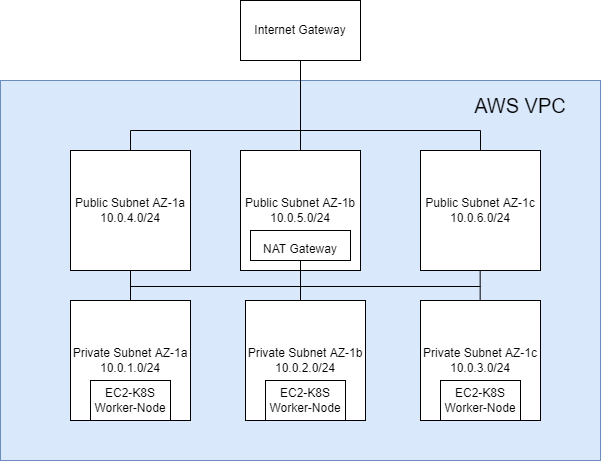

# Setting up AWS EKS
The terraform folder contain the infra-as-code to setup an EKS from scratch including vpc, subnets, security groups, nat gateway, internet gateway.




# How to build the application locally

## Prerequisite
You have installed Docker on your local machine.

## How-to
The Dockerfile will be used to build the application.

Run the following command to build the application locally on your machine.
```
docker build -t demo-java-app .
```

# Using Jenkins as your CI/CD tool

## Prerequisite
You have installed Jenkins as your CI/CD tool.

You also have installed the following plugins on your Jenkins.

1. Amazon Web Services SDK :: All
2. Amazon ECR Plugin
3. CloudBees Docker Build and Publish Plugin
4. Docker Commons Plugin
5. Kubernetes Continuous Deploy Plugin

Additionally, you should have configured your AWS and Kubernetes credentials inside Jenkins.

## How-to
Setup a pipeline in your Jenkins and configure your pipeline to read the Jenkinsfile from this repo.
